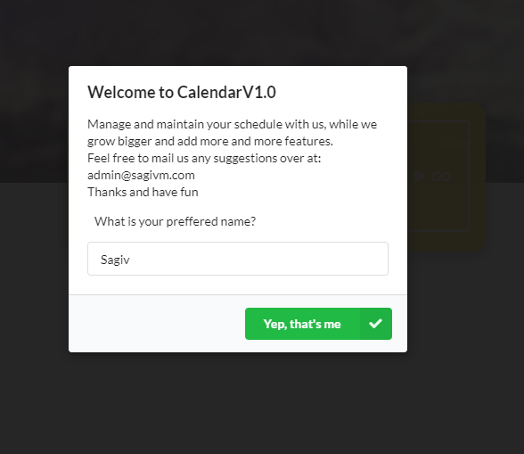
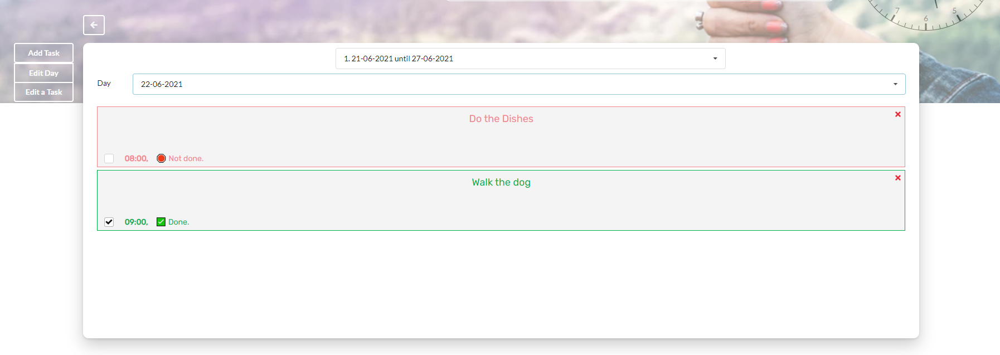
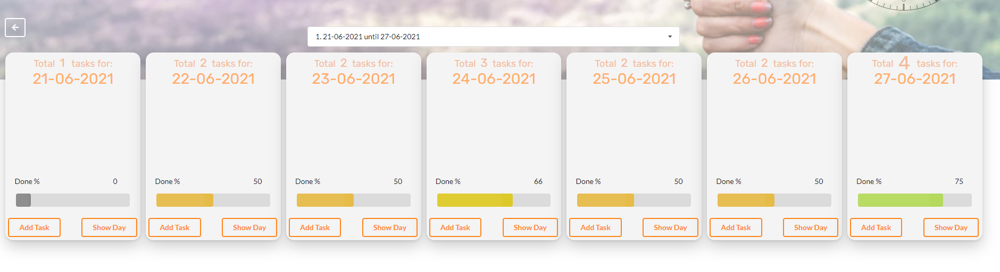
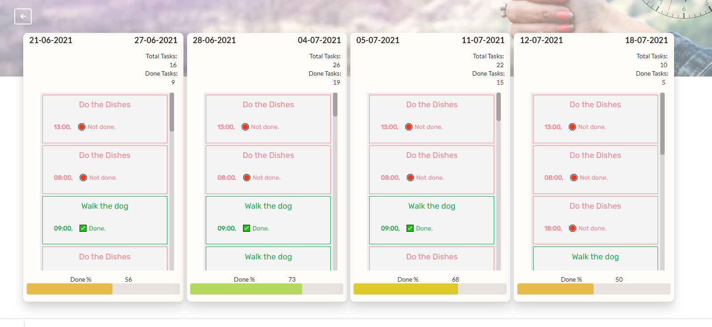
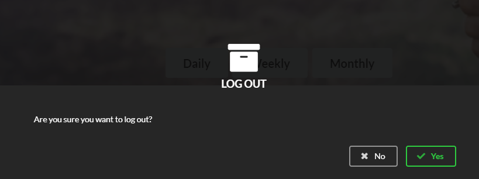
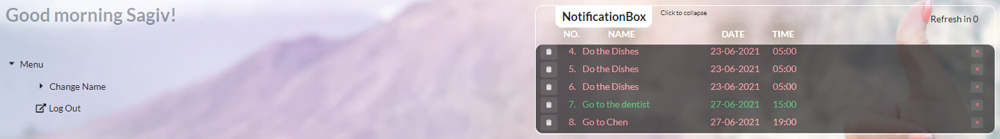
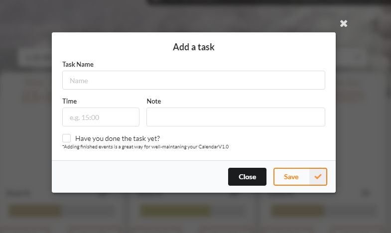
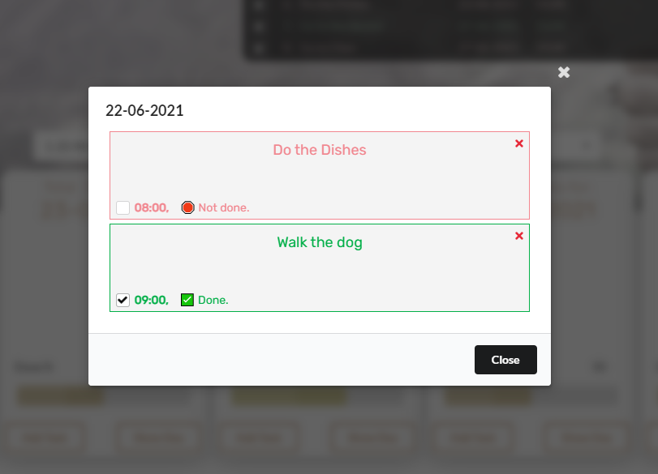

# Calendar

### Table of contents
* [General Info](#general-info)
* [Tabs list](#tabs-list)
* [Screenshots](#screenshots)
* [License](#license)

### General Info

CalendarV1.0 is a mobile-ready calendar, offline-storage compatible,
ReactJS based application with full purpose to maintain and manage your schedule.

### Tabs list (Click for Screenshots)

- [Welcome](#welcome)
    1. [welcome](#welcome-)
    2. [welcome-dashboard](#welcome-dashboard)
- [Daily](#daily)
    1. [Daily-Calendar](#daily-calendar)
- [Weekly](#weekly)
    1. [Weekly-Calendar](#weekly-calendar)
- [Monthly](#monthly)
    1. [Monthly-Calendar](#monthly-calendar)
- [Misc](#misc)
    1. [login](#login)
    2. [logout](#logout)
    3. [user-panel](#user-panel)
    4. [add-task](#add-task)
    5. [day-modal](#day-modal)

## Screenshots
##### Welcome

- ####### Welcome

- ####### Welcome Dashboard

##### Daily

- ###### Daily-Calendar
 

##### Weekly

- ###### Weekly-Calendar

##### Monthly
- ###### Monthly-Calendar

#### Misc
- ###### Login

- ###### Logout

- ###### User-Panel

- ###### Add-Task

- ###### Day-Modal

## License

MIT

